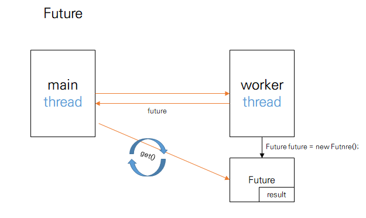
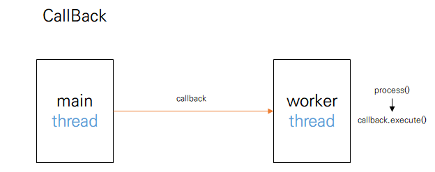
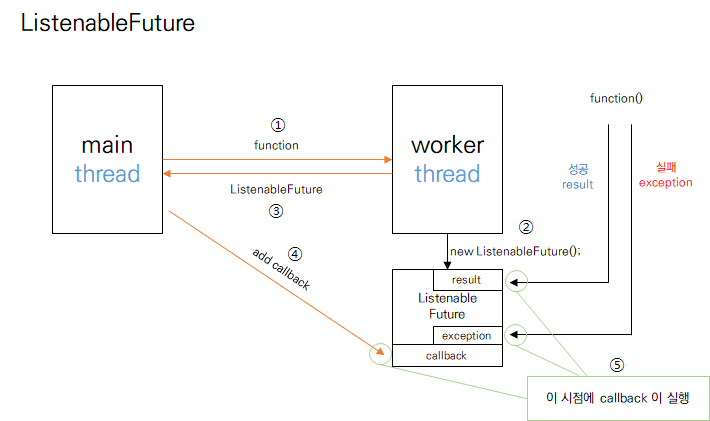

# java 로 비동기를 구현해보자

## Future 와 CallBack

자바에서 비동기를 구현하는 두 가지 방법을 간단히 살펴봅니다.
실제 사용되는 구현체들은 복잡하지만 이해하기 쉽도록 예제를 간단히 구현하였습니다.

이 둘은 쓰레드를 생성하고 함수를 실행하여 사용 중인 쓰레드를 차단 없이 지속적으로 사용하려는 목적을 가집니다.
이때 결과값을 처리하는 방법에 따라 `Future`와 `Callback`으로 나눌 수 있습니다.

### Future

- [간단한 Future 구현](/async/jun/example/future/FutureExample.java)

생성한 스레드에서 프로세스를 실행한 후 결과값을 공유 자원에 저장하고 가져오는 방법을 `Future`라고 합니다.
예제에서는 메서드를 실행 후 공유 저장소로 사용되는 `Future`인스턴스를 반환하도록 구현합니다.
  
> 자바는 1.5 버전에서 Future 를 도입했는데 구현체로 FutureTask 를 제공합니다.
  
반환받은 Future 에서 **get()** 메서드를 사용하면 앞으로 도착할 결과값을 기다렸다가 받을 수 있습니다.
이때 사용 중인 스레드는 **차단**됩니다.

### Callback

- [간단한 Callback 구현](/async/jun/example/callback/CallBackExample.java)

Callback 은 **생성한 스레드**에서 프로세스를 실행 후 파라미터로 전달받은 **callback 클래스의 메서드를 실행**하는 방법입니다.
**메인 스레드는 차단되지 않고** 본 작업을 계속 수행합니다.

이 방법의 예제는 다음과 같습니다.

### Future vs Callback

이 둘의 큰 차이점은 작업한 결과를 처리하는 대상이 누구인가 하는 점입니다.(`사용 중인 쓰레드` 혹은 `새로 만든 쓰레드`)
만약 연산 결과를 주 실행 쓰레드에서 사용해야 한다면 `Future`를, 영향이 없다면 `Callback` 을 사용하면 됩니다.

## ListenableFuture

- [간단한 ListenableFuture 구현](/async/jun/example/asyncFuture/ListenableFutureExample.java)

guava 는 이 둘을 혼합한 [ListenableFuture](https://github.com/google/guava/wiki/ListenableFutureExplained) 를 제공합니다.
([스프링에서는 4.0](https://docs.spring.io/spring/docs/current/javadoc-api/org/springframework/util/concurrent/ListenableFuture.html)
부터 제공하고 있습니다.)

이 방법은 작업이 완료되었을 때 실행되는 `callback 을 나중에 등록할 수 있는 것` 이 핵심입니다.
외부의 쓰레드에서 프로세스 처리 후 바로 실행하는 callback 과 달리 future 방식을 이용해 값을 보관하여 **실행을 지연**시킬 수 있습니다.
이를 통해 callback 함수를 별도로 추가할 수 있고 더 나아가 여러 작업들을 **구성**하여 사용할 수 있습니다.

